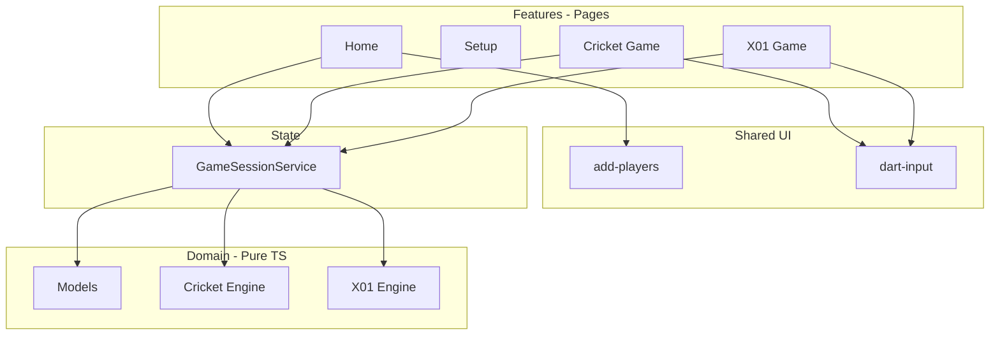

# Darts Scoring App — Architecture Reference

> Reference doc for project structure, conventions, and evolution beyond MVP.  
> Stack: **Angular 19**, standalone components, signals-friendly.

---

## Goals

- Home page: choose game mode (Cricket or X01)
- X01: secondary choice for starting score (301 / 501 / 701)
- Up to **4 addable players** per match
- Pass-and-play on a single device (MVP)
- Domain rules in **pure TypeScript** (testable, backend-agnostic later)
- By-hand code, no AI generated code except asked for explicitly. AI assistance only for architecture/code review, this is a learning project. 

---

## Folder Structure

```
src/app/
├── core/                    # App-wide singletons & infrastructure
│   └── guards/              # e.g. game-session.guard.ts
├── shared/                  # Reusable UI (no business rules)
│   └── add-players/         # Player list UI
├── domain/                  # Pure TS — no Angular imports
│   ├── models/              # Player, DartThrow, GameSession, etc.
│   ├── cricket/             # Cricket engine & rules
│   └── x01/                 # X01 engine & rules
├── features/                # Routed pages (screens)
│   ├── home/
│   ├── setup/               # Optional; may merge with home early on
│   ├── cricket-game/
│   └── x01-game/
├── state/                   # Client session state
│   └── game-session.service.ts
├── app.routes.ts
├── app.config.ts
└── app.component.ts         # Shell: <router-outlet /> only
```

### What goes where

| Folder | Purpose | Examples |
|--------|---------|----------|
| `core/` | One-instance app infrastructure | Route guards, future HTTP interceptors, app config |
| `shared/` | Reusable UI used on multiple pages | `add-players`, dart input, scoreboard rows |
| `domain/` | Business types & rule engines | `Player`, `applyThrow()`, bust logic |
| `features/` | Full pages loaded by the router | Home, game screens |
| `state/` | Active match/session on the client | `GameSessionService` |

**Not in `core/`:** domain interfaces and game rules → use `domain/models/`.

---

## Routing

Angular paths **do not** start with `/` in route config.

| Route | Component | Purpose |
|-------|-----------|---------|
| `''` | `HomeComponent` | Mode selection, x01 score, players |
| `setup/:mode` | `SetupComponent` | Optional dedicated setup (if split from home) |
| `game/cricket-game` | `CricketGameComponent` | Live Cricket scoring |
| `game/x01-game` | `X01GameComponent` | Live X01 scoring |

> **Note:** Game routes may be renamed to `game/cricket` and `game/x01` for consistency — update routes and navigation together.

### Navigation flow

```
/  (Home)
  → pick mode (+ x01 score if x01)
  → add 1-4 players
  → Start
  → /game/cricket-game  OR  /game/x01-game
```

### Guards (recommended before game routes)

- Block `/game/*` if no valid session (no players or game not initialized)
- Redirect to `/`

### Root shell

`app.component.html` must contain:

```html
<router-outlet />
```

---

## Domain Models (`domain/models/`)

Pure TypeScript interfaces/types — no Angular.

### Shared

- **Player** — `id`, `name`, `order` (optional turn index)
- **DartThrow** — `segment` (1-20 | bull), `multiplier` (1 | 2 | 3)
- **Turn** — `playerId`, `throws[]` (max 3)
- **GameMode** — `'cricket' | 'x01'`
- **GameSession** — mode, players, settings, active game state, status (`setup | in_progress | finished`)

### Settings

**Cricket**

- Targets: 15-20 + bull (fixed for v1)
- Scoring variant: decide early (standard vs cut-throat)

**X01**

- Starting score: 301 | 501 | 701
- Double in / double out toggles
- Bull scoring rules (25 vs 50) — decide early

---

## Game Engines (`domain/cricket/`, `domain/x01/`)

Pure functions or classes. No `HttpClient`, no components.

### Common interface (conceptual)

- `applyThrow(state, throw)` → new state + result/events
- `endTurn(state)` → advance player
- `undoLastThrow(state)` → revert last dart
- `isFinished(state)` / `getWinner(state)`

### Cricket rules to implement

1. Marks: S=1, D=2, T=3 on a target
2. Close target at ≥3 marks
3. Points on closed targets (define opponent-open rules)
4. Win: all targets closed + point tie-break

### X01 rules to implement

1. Subtract dart value from remaining score
2. **Bust:** below 0, land on 1 with double-out, invalid finish → revert turn
3. **Double in:** first scoring throw must be double (if enabled)
4. **Double out:** winning throw must be double (if enabled)

### Engine results

Return structured results, not just state:

- `success | bust | invalid | game_won`
- Optional `events[]`: `target_closed`, `points_scored`, etc.

UI shows messages from engine results — **do not duplicate rules in templates**.

---

## State Management

### MVP (current)

- `AddPlayersComponent`: child-owned player list UI
- Emits to parent via `@Output()` or `output()`
- `HomeComponent`: holds `selectedGamemode`, `selectedX01Score`, `players`

### Next step (before game navigation)

**`GameSessionService`** in `state/` — single source of truth:

- `players`, `mode`, `x01Settings`, `gameState`
- Home writes on **Start**; game screens read
- Use `signal()` / `computed()` (Angular 19)

### Future (backend)

```
features/     → UI only
state/        → client session cache (signals)
domain/       → rules + models (unchanged)
core/api/     → HttpClient, DTO mapping, optional WebSocket
```

| Feature | Backend needed? |
|---------|-----------------|
| Local pass-and-play | No |
| localStorage history | No |
| Accounts, cross-device stats | Yes |
| Online multiplayer | Yes (REST + WebSocket) |

Domain engines stay client-side; API layer maps DTOs ↔ domain models.

---

## Component Communication

| Pattern | Use when |
|---------|----------|
| `signal()` inside component | Local UI state |
| `@Output()` / `EventEmitter` | Child → parent (classic) |
| `output()` | Child → parent (modern, Angular 17.3+) |
| `GameSessionService` | Multiple routes/screens share state |
| `@Input()` / `input()` | Parent passes data down |

**Signals do not replace `@Output`** for parent-child events — they replace local reactive state. Use `output()` if preferring the signal-era API.

---

## Feature Pages

### Home (`features/home/`)

- Gamemode select: `cricket` | `x01`
- Conditional x01 score select: `@if (selectedGamemode === 'x01')`
- `<app-add-players (playersChange)="...">`
- **Start game** button → validate → write session → navigate

Requires `FormsModule` in standalone `imports` for `ngModel`.

### Add Players (`shared/add-players/`)

- Default 2 players; add up to 4; remove down to 1
- Emit on every change; emit defaults in `ngOnInit` so parent has initial list
- `maxPlayers = 4`

### Game screens

- Read from `GameSessionService`
- Shared widgets: dart input, turn summary, undo, end turn
- Mode-specific scoreboard (Cricket grid vs X01 remaining scores)

---

## Shared UI (to build)

| Component | Role |
|-----------|------|
| `add-players` | Name list, add/remove |
| `dart-input` | Segment + S/D/T + bull + miss |
| `turn-summary` | Current turn's darts |
| `game-actions` | Undo, end turn, new game |
| Scoreboard pieces | Mode-specific |

Input components emit `DartThrow`; engines validate.

---

## Rules Decisions (lock before coding engines)

Document chosen rules in code comments or a `RULES.md` when implementing.

**Cricket**

- [ ] Standard or cut-throat scoring?
- [ ] Points only when opponent still open?
- [ ] Bull mark split (single/double bull)?

**X01**

- [ ] Default starting score
- [ ] Double in/out defaults
- [ ] Bull = 25 or 50 for checkout?

**Both**

- [ ] Turn order (fixed rotation for v1)
- [ ] Cricket tie handling

---

## Build Order

1. Domain models
2. X01 engine (simpler — proves turn flow)
3. `GameSessionService` + minimal X01 game screen
4. Home + routing + guard
5. `add-players` component
6. Cricket engine + Cricket screen
7. Polish: undo, layout, optional localStorage

---

## Deferred (post-MVP)

- Match history / statistics UI
- Legs and sets
- Online multiplayer
- Custom Cricket targets
- Checkout suggestions (UI helper)
- NgRx (use signals + service until complexity demands more)

---

## CLI Conventions

Pages:

```bash
ng generate component features/home --skip-tests
ng generate component shared/add-players --skip-tests
```

Services / guards:

```bash
ng generate service state/game-session --skip-tests
ng generate guard core/guards/game-session --skip-tests
```

Standalone components: add all used modules/components to each component's `imports` array.

---

## Architecture Diagram



---

## Current Project Status (update as you go)

- [x] Angular 19 standalone app scaffolded
- [x] Feature page components generated (home, setup, cricket-game, x01-game)
- [x] Home: gamemode select, conditional x01 score
- [x] `<router-outlet />` in app shell
- [x] Default route `''` → `HomeComponent`
- [x] Route paths without leading `/` (setup route fixed)
- [ ] `add-players` shared component
- [ ] `GameSessionService`
- [ ] Domain models & engines
- [ ] Game route guard
- [ ] Game screens wired to session
