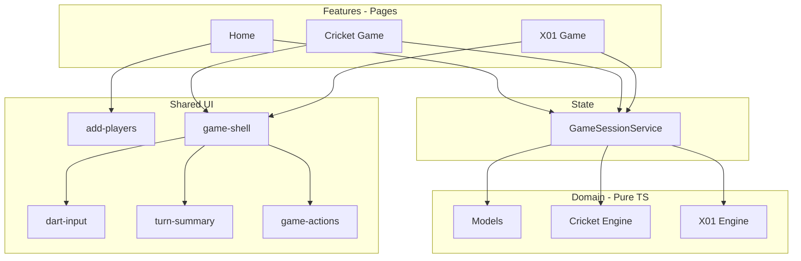

# Darts Scoring App — Architecture Reference

> Reference doc for project structure, conventions, and evolution beyond MVP.  
> Stack: **Angular 19**, standalone components, signals-friendly.  
> End goal: wrap this web app with **Capacitor** and ship it as a phone app (Android first).
>
> Locked game rules live in [`RULES.md`](./RULES.md). The feature plan lives in [`ROADMAP.md`](./ROADMAP.md).

---

## Goals

- Home page: choose game mode (Cricket or X01)
- X01: starting score (301 / 501 / 701). Double in / double out exist on the engine; Home exposes them in Phase 5.1b
- Up to **4 addable players** per match
- Pass-and-play on a single device (MVP in the browser, then the same UI on a phone)
- Domain rules in **pure TypeScript** (testable, backend-agnostic later)
- Ship as a native-shell app with **Capacitor** (Phase 6). No backend for local play.

---

## Folder Structure

```
src/app/
├── core/                    # App-wide singletons & infrastructure
│   └── guards/              # e.g. game-session.guard.ts
├── shared/                  # Reusable UI (no business rules)
│   ├── add-players/         # Player list UI
│   ├── dart-input/          # Segment pad
│   ├── turn-summary/        # Current turn slots
│   ├── game-actions/        # Undo / End turn
│   └── game-shell/          # Shared game chrome
├── domain/                  # Pure TS — no Angular imports
│   ├── models/              # Player, DartThrow, GameSession, etc.
│   ├── cricket/             # Cricket engine & rules
│   └── x01/                 # X01 engine & rules
├── features/                # Routed pages (screens)
│   ├── home/                # Mode, X01 score, players, Start
│   ├── cricket-game/
│   └── x01-game/
├── state/                   # Client session state
│   └── game-session.service.ts
├── app.routes.ts
├── app.config.ts
└── app.component.ts         # Shell: <router-outlet /> only
```

### What goes where

| Folder | Purpose | Examples |
|--------|---------|----------|
| `core/` | One-instance app infrastructure | Route guards, future HTTP interceptors, app config |
| `shared/` | Reusable UI used on multiple pages | `add-players`, dart input, scoreboard rows |
| `domain/` | Business types & rule engines | `Player`, `throwDart()`, bust logic |
| `features/` | Full pages loaded by the router | Home, game screens |
| `state/` | Active match/session on the client | `GameSessionService` |

**Not in `core/`:** domain interfaces and game rules → use `domain/models/`.

---

## Routing

Angular paths **do not** start with `/` in route config.

| Route | Component | Purpose |
|-------|-----------|---------|
| `''` | `HomeComponent` | Mode selection, x01 score, players |
| `game/cricket-game` | `CricketGameComponent` | Live Cricket scoring |
| `game/x01-game` | `X01GameComponent` | Live X01 scoring |
| `**` | redirect to `''` | Unknown paths |

Home owns setup. There is no dedicated setup route.

### Navigation flow

```
/  (Home)
  → pick mode (+ x01 score if x01)
  → add 1-4 players
  → Start
  → /game/cricket-game  OR  /game/x01-game
```

### Guards

Implemented in `core/guards/game-session.guard.ts`:

- Block `/game/*` if there is no valid session
- Block a game route when the session mode does not match the route
- Redirect to `/`

The session lives in memory. A page refresh clears it, so `/game/*` redirects to Home until Phase 5.2 persistence.

### Root shell

`app.component.html` must contain:

```html
<router-outlet />
```

---

## Domain Models (`domain/models/`)

Pure TypeScript interfaces/types — no Angular.

### Shared

- **Player** — `id`, `name`, `order` (optional turn index)
- **DartThrow** — discriminated union in `domain/models/dart-throw.ts`:
  - `{ kind: 'miss' }`
  - `{ kind: 'single'; target: DartTarget }`
  - `{ kind: 'double'; target: DartTarget }`
  - `{ kind: 'triple'; target: NumberSegment }`
  - Triple bull is not representable
- **Turn** — `playerId`, `throws[]` (max 3). Engines extend this (`X01Turn`, `CricketTurn`)
- **GameMode** — `'cricket' | 'x01'`
- **GameSession** — thin shell in `domain/models/game.ts`: `mode`, `players`, `status` (`in_progress | finished`), `winnerId`
- **ActiveSession** — the live match in `state/game-session.service.ts`: shell fields plus mode-specific `settings` and `gameState`

### Settings

**Cricket** (`CricketSettings` on the engine)

- Targets: 15–20 + bull (fixed for v1)
- Scoring: standard only (not cut-throat). See [`RULES.md`](./RULES.md)

**X01** (`X01Settings` on the engine)

- Starting score: 301 | 501 | 701
- Double in / double out toggles (defaults: Off / On)
- Inner bull (50) is D25; outer bull (25) is a single. See [`RULES.md`](./RULES.md)

---

## Game Engines (`domain/cricket/`, `domain/x01/`)

Pure functions. No `HttpClient`, no components. Implement [`RULES.md`](./RULES.md) only.

### Common interface

Engines:

- `throwDart(state, dart)` → new state + result/events (Cricket also takes `playerId`)
- `endTurn(state)` → advance player (X01 only; Cricket has no turns)
- `undoLastThrow(state)` → revert last dart / last zone tap
- `isFinished(state)` / `getWinner(state)` (X01); Cricket uses `status` / `winnerId` on state

`GameSessionService.applyThrow(dart, playerId?)` wraps `throwDart` for the active mode. Cricket needs `playerId`.

### Cricket (implemented)

1. No turns. A zone tap is one single dart for that player
2. Marks: S=1, D=2, T=3 on a target (outer bull = 1, inner bull = 2). The board sends singles
3. Close target at ≥3 marks
4. The closing dart does not score. Later darts score only while an opponent still has the target open
5. Win: all targets closed + point tie-break; equal points after deadlock = draw
6. Undo reverts the last tap

### X01 (implemented)

1. Subtract dart value from remaining score
2. **Bust:** below 0; remaining 1 when double-out is On; invalid checkout → revert turn
3. **Double in:** first scoring throw must be double (if enabled)
4. **Double out:** winning throw must be double (if enabled)
5. When double-out is Off, checkout on 0 with any dart (including S1)

### Engine results

Return structured results, not just state.

**X01** `X01Result`: `success | bust | invalid | game_won`  
**X01** `X01Event`: `turn_completed`, `bust`, `double_in`, `checkout`

**Cricket** `CricketResult`: `success | invalid | game_won | draw`  
**Cricket** `CricketEvent`: `turn_completed`, `target_closed`, `points_scored`

UI shows messages from engine results — **do not duplicate rules in templates**.

---

## State Management

### Current

- `AddPlayersComponent`: child-owned player list UI
- Emits to parent via `output()`
- `HomeComponent`: holds `selectedGamemode`, `selectedX01Score`, `players`

**`GameSessionService`** in `state/` is the single source of truth for the live match:

- `players`, `mode`, `x01Settings` / `cricketSettings`, `x01GameState` / `cricketGameState`
- Home writes on **Start**; game screens read
- Actions: `startGame`, `applyThrow`, `endTurn`, `undoLastThrow`, `reset`
- `signal()` / `computed()` (Angular 19)
- In memory only until Phase 5.2 (`localStorage` with a schema version)

### Future (backend)

```
features/     → UI only
state/        → client session cache (signals)
domain/       → rules + models (unchanged)
core/api/     → HttpClient, DTO mapping, optional WebSocket
```

| Feature | Backend needed? |
|---------|-----------------|
| Local pass-and-play | No |
| Capacitor phone wrap (Phase 6) | No |
| localStorage live session (Phase 5.2) | No |
| Simple match history (Phase 5.2b) | No |
| Accounts, cross-device stats | Yes |
| Online multiplayer | Yes (REST + WebSocket) |

Domain engines stay client-side; API layer maps DTOs ↔ domain models.

---

## Mobile wrap (Capacitor)

The Angular app is the product. Capacitor is a native shell around the same build. Domain engines and `GameSessionService` stay in the WebView. Do not move rules into native code.

**Android first.** This repo is on Windows. iOS needs a Mac and waits until after the Android wrap works.

### What Phase 5 must already do (wrap-ready)

- Phone-width layout first. Do not design for a wide desktop and then shrink.
- Tap targets about 44px. Do not use hover-only controls.
- Pad the shell with `env(safe-area-inset-*)` for notch and status bar. Set `viewport-fit=cover` on the viewport meta.
- Persist the live session (Phase 5.2). The OS can kill the WebView.
- Confirm leave **inside the app** (`CanDeactivate` + a Leave control). Do not use `beforeunload` as the main guard — it does not run in Capacitor.
- Keep `base href="/"` and PathLocationStrategy. Capacitor 6+ serves `https://localhost`.

### What Phase 6 adds (the wrap)

- `@capacitor/cli` + `@capacitor/core` + `@capacitor/android`
- `webDir`: `dist/darts-project/browser` (Angular 19 application builder)
- Build the web app, then `npx cap sync android`
- Optional later: StatusBar, SplashScreen, hardware back button, iOS

Do not add Capacitor plugins in Phase 5.

---

## Component Communication

| Pattern | Use when |
|---------|----------|
| `signal()` inside component | Local UI state |
| `@Output()` / `EventEmitter` | Child → parent (classic) |
| `output()` | Child → parent (modern, Angular 17.3+) |
| `GameSessionService` | Multiple routes/screens share state |
| `@Input()` / `input()` | Parent passes data down |

**Signals do not replace `@Output`** for parent-child events — they replace local reactive state. Use `output()` if preferring the signal-era API.

---

## Feature Pages

### Home (`features/home/`)

- Gamemode select: `cricket` | `x01`
- Conditional x01 score select: `@if (selectedGamemode === 'x01')`
- `<app-add-players (playersChange)="...">`
- **Start game** button → validate → write session → navigate
- Double in / double out toggles: Phase 5.1b (engine already accepts them)

Requires `FormsModule` in standalone `imports` for `ngModel`.

Home layout is in `home.component.scss` (phone-first stack).

### Add Players (`shared/add-players/`)

- Default 2 players; add up to 4; remove down to 1
- Emit on every change; emit defaults in `ngOnInit` so parent has initial list
- `maxPlayers = 4`
- Layout is in `add-players.component.scss` (name row + add row)

### Game screens

- Read from `GameSessionService`
- X01: `game-shell` (dart input, turn summary, undo, end turn, winner banner)
- Cricket: mark-zone scoreboard + Undo (no keypad, no turns)
- Mode-specific scoreboard (Cricket grid vs X01 remaining scores)

---

## Shared UI (built)

| Component | Role |
|-----------|------|
| `add-players` | Name list, add/remove |
| `dart-input` | Segment + S/D/T + bull + miss |
| `turn-summary` | Current turn's darts |
| `game-actions` | Undo, end turn |
| `game-shell` | Winner banner, message, dart pad, actions; scoreboard via content |
| Scoreboard pieces | Mode-specific (on each game feature) |

Input components emit `DartThrow`; engines validate.

Game widgets have SCSS. Home, add-players, and the app shell (`app.component.scss`) also have SCSS. Phone-first layout and ~44px tap targets are in place (Phase 5.1).

---

## Rules

Do not keep a second rule checklist here. Engines implement [`RULES.md`](./RULES.md). The UI never re-implements rules.

---

## Build Order

Follow [`ROADMAP.md`](./ROADMAP.md). Phases 0–4 and 5.1 are done. Next: 5.1b (Home double in / double out), then persist, session UX, then Phase 6 (Capacitor Android wrap).

---

## Deferred (after the Capacitor wrap)

Phase 5.2b adds a simple match-history screen. Phase 6 wraps the app. These stay later:

- iOS Capacitor project (needs a Mac)
- Statistics UI over match history
- Legs and sets
- Online multiplayer
- Custom Cricket targets
- Checkout suggestions (UI helper)
- NgRx (use signals + service until complexity demands more)

---

## CLI Conventions

Pages:

```bash
ng generate component features/home --skip-tests
ng generate component shared/add-players --skip-tests
```

Services / guards:

```bash
ng generate service state/game-session --skip-tests
ng generate guard core/guards/game-session --skip-tests
```

Standalone components: add all used modules/components to each component's `imports` array.

---

## Architecture Diagram



---

## Current Project Status (update as you go)

> The implementation plan lives in [`ROADMAP.md`](./ROADMAP.md) — status checkboxes below mirror it.

- [x] Angular 19 standalone app scaffolded
- [x] Feature page components generated (home, cricket-game, x01-game; setup removed)
- [x] Home: gamemode select, conditional x01 score
- [x] `<router-outlet />` in app shell
- [x] Default route `''` → `HomeComponent`
- [x] Route paths without leading `/`
- [x] `add-players` shared component (1–4 players, editable names)
- [x] `RULES.md` — lock rule variants (Phase 0)
- [x] Domain models (Phase 1.1)
- [x] X01 engine (Phase 1.2)
- [x] X01 engine unit tests (Phase 1.3)
- [x] `GameSessionService` (Phase 2)
- [x] Game route guard (Phase 2)
- [x] Phase 3 shared widgets (`dart-input`, `turn-summary`, `game-actions`, `game-shell`)
- [x] X01 game screen wired to session (Phase 3)
- [x] Cricket engine (Phase 4)
- [x] Cricket game screen wired to session (Phase 4)
- [ ] Phase 5 — phone-first design, X01 toggles, persist, session UX
- [ ] Phase 6 — Capacitor Android wrap
